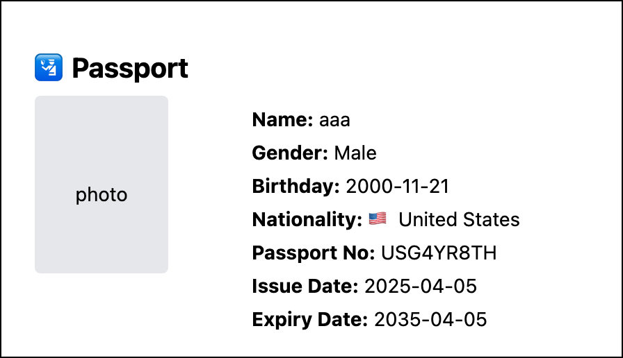

# 🌀 Rebirth Passport

This is a small **for-fun project** inspired by the idea of **rebirth** — what if you could be randomly born in another country, with a brand new identity and a fresh passport?

It's a playful little experiment that also gave me a chance to practice **vibe coding**, and work with tools I enjoy:  
**React + TypeScript + Tailwind CSS**.

---

## 🌍 What it does

- Lets users input their name, gender, and birthday
- Randomly assigns a new nationality (weighted by real-world population)
- Generates a mock passport with:
  - Emblem
  - Passport number
  - Validity dates
- Allows you to **save it as an image** via screenshot
- Includes a little spinning-earth animation to mark the moment of rebirth

---

## 🛠️ Tech Stack

- **React**
- **TypeScript**
- **Tailwind CSS**
- **html2canvas** for image export
- **Vercel** for deployment

---

## 🚀 Try it live

Coming soon at: [rebirth-passport.vercel.app](https://rebirth-passport.vercel.app)  
(Once deployed via Vercel)

---

## 🎯 Why I made this

I just thought the concept of "rebirth" — being randomly dropped into the world with new attributes — was a fun and philosophical idea to play with. And it was a great excuse to vibe code for a night and touch some TypeScript.

---

## 📷 Example

---

> Made with curiosity ✨ and deployed for fun.
